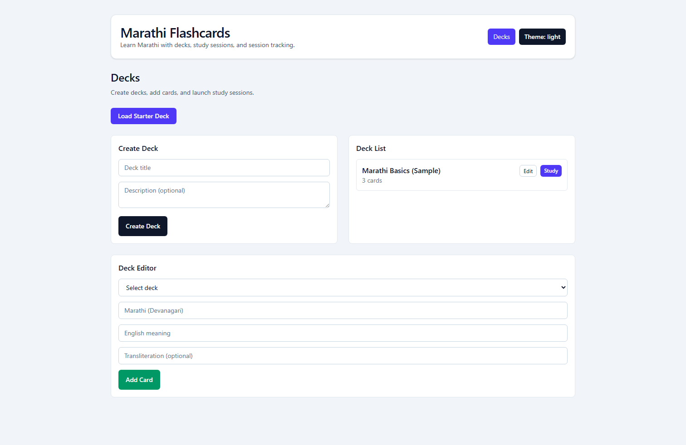
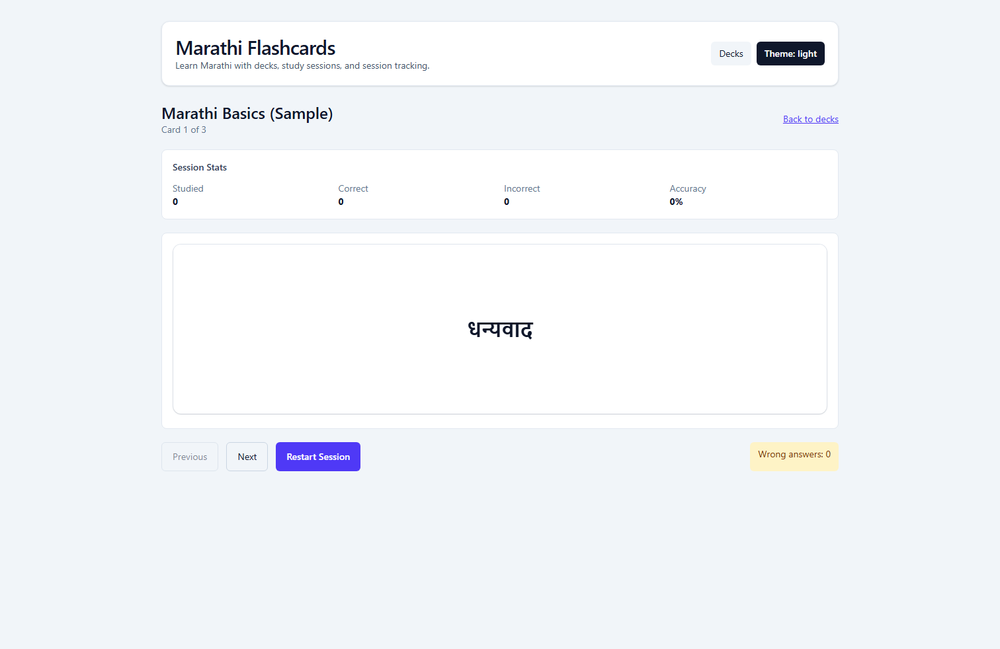
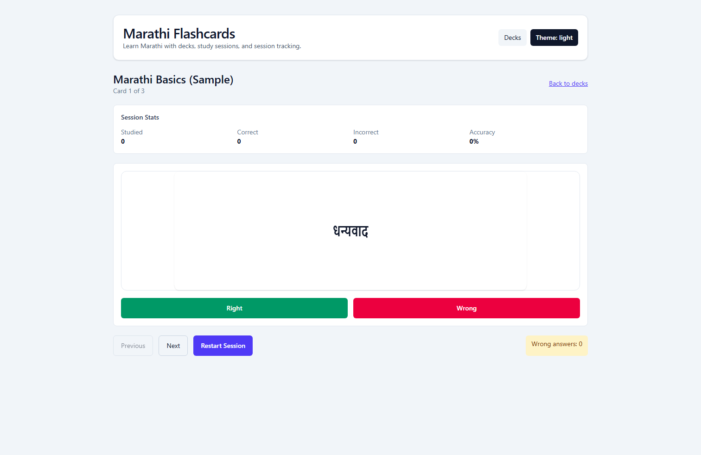

# Marathi Flashcards

Built with Cursor AI coding tool under Rehan's direction.

Local single-user web app for learning Marathi (Devanagari), built with React + TypeScript.

## Project Structure

```text
flash-card/
├── docs/                     # Product and implementation planning artifacts
│   ├── specification.md      # Source-of-truth requirements and functional scope
│   └── TODO.md               # Phase-by-phase checklist with acceptance criteria
├── public/                   # Static files served directly by Vite
├── src/                      # Application source code
│   ├── assets/               # Images/icons used by UI components
│   ├── store/                # Zustand state and actions
│   ├── test/                 # Shared testing setup and helpers
│   ├── App.tsx               # Root app shell
│   ├── App.test.tsx          # App bootstrap smoke test
│   ├── index.css             # Global styles and Tailwind entrypoint
│   └── main.tsx              # React bootstrap and root mount
├── .gitignore                # Git ignore rules
├── .prettierrc               # Formatter rules
├── eslint.config.js          # Linting standards
├── jest.config.cjs           # Test runner configuration
├── tsconfig*.json            # TypeScript configs (app/node/test)
├── vite.config.ts            # Vite build/dev configuration
└── README.md                 # Developer onboarding guide
```

## New Developer Onboarding

1. Read `docs/specification.md` for product scope and constraints.
2. Read `docs/TODO.md` and pick the next unchecked task.
3. Read testing standards docs (`docs/PlaywrightE2ETests.md`, `docs/TestCases.md`, and `.cursor/rules/e2e-tests.mdc`) before changing E2E tests.
4. Run app + lint + tests locally before making changes.
5. Implement against acceptance criteria, then verify manually.
6. Update docs and TODO status only after criteria are satisfied.

## Standards & Governance

- `docs/PlaywrightE2ETests.md`: source-of-truth E2E instructions (POM, fixtures, hooks, quality gates, naming).
- `.cursor/rules/e2e-tests.mdc`: actionable Cursor enforcement rules for E2E implementation details.
- `docs/TestCases.md`: current high-level E2E coverage list with `TCxxx` IDs that must stay synchronized with Playwright test titles.

## Getting Started

1. Install dependencies:

   ```bash
   npm install
   ```

2. Start development server:

   ```bash
   npm run dev
   ```

3. Build for production:

   ```bash
   npm run build
   ```

## Architecture Notes

- **Frontend:** React + TypeScript with Vite for fast feedback loops.
- **State management:** Zustand for explicit state updates and minimal boilerplate.
- **Styling:** Tailwind CSS with class-based dark mode (`html.dark`).
- **Testing:** Jest + React Testing Library for unit/component confidence.
- **Planning discipline:** `docs/specification.md` and `docs/TODO.md` are the product truth.

## Engineering Standards

- Keep business logic out of presentational components; isolate it in `store`, `lib`, or feature modules.
- Favor feature-first structure as scope grows (`features/decks`, `features/study`, `features/quiz`).
- Use strict TypeScript types for persisted data and state transitions.
- Make incremental PR-sized changes and verify acceptance criteria before closing TODO items.
- Write tests with every non-trivial behavior change (especially persistence, scoring, and matching logic).

## Suggested Scaled Layout

```text
src/
├── app/                      # App shell, routing, providers
├── features/
│   ├── decks/                # Deck list/editor and CRUD
│   ├── study/                # Flip flow, right/wrong, redo unknown
│   ├── quiz/                 # MCQ + fill-in flows and grading
│   ├── stats/                # Session stats and summaries
│   └── settings/             # Theme and learning preferences
├── components/               # Reusable UI primitives
├── store/                    # Zustand slices/global state
├── lib/                      # Pure utilities (storage, shuffle, matcher, debounce)
├── types/                    # Shared interfaces/types
├── assets/
└── test/
```

## Definition of Done

This checklist is mandatory and should be followed for every task before marking work complete.

- Acceptance criteria in `docs/TODO.md` are satisfied and verified.
- Relevant automated tests are added/updated.
- `npm run lint` and `npm run test` pass locally.
- README/docs reflect any behavior or structure changes.

## Scripts

- `npm run dev` starts the Vite dev server.
- `npm run build` creates a production build.
- `npm run preview` previews the production build locally.
- `npm run lint` runs ESLint checks.
- `npm run test` runs Jest + React Testing Library tests.
- `npm run test:e2e` runs Playwright end-to-end tests.
- `npm run test:e2e:ui` opens Playwright UI mode for debugging tests.
- `npm run screenshots:readme` refreshes high-level app screenshots used in README.
- `npm run format` formats files with Prettier.

## Test Automation

```text
tests/
└── e2e/
    ├── specs/                 # Feature-level happy path scenarios (phase0/1/2)
    ├── pages/                 # Page Object Models (high-level UI actions/assertions)
    ├── fixtures/              # Shared test data + Playwright fixtures (POM object wiring)
    ├── support/               # Common e2e utilities/decorators (e.g., @step)
    └── tsconfig.json          # E2E TypeScript config + path aliases
```

- Use the test pyramid: keep most coverage in unit tests (`npm run test`) and keep e2e focused on critical user journeys (`npm run test:e2e`).
- Use stable selectors via `data-testid` with `af-` prefix (first attribute on tagged elements).
- Use path aliases from `tests/e2e/tsconfig.json` (`@pages/*`, `@fixtures/*`, `@support/*`) instead of deep relative imports.
- Use Playwright fixtures from `tests/e2e/fixtures/testFixtures.ts` to inject POM objects into tests.
- Use `expect.soft(...)` for non-critical checks when you want the scenario to continue collecting failures.
- Artifacts are generated at `playwright-report/` (HTML report) and `test-results/` (screenshots/videos/traces).
- Generate and open report with:

  ```bash
  npm run test:e2e
  npx playwright show-report
  ```

- Open an individual trace with:

  ```bash
  npx playwright show-trace <trace.zip>
  ```

- Change policy: when a new phase is implemented, run existing tests first, fix regressions, then add tests for the new acceptance criteria.
- Reporter setup is intentionally low-maintenance: local runs use Playwright list/html reports, while `@estruyf/github-actions-reporter` runs only in CI for GitHub workflow summaries.

## First-Day Workflow

- Install dependencies: `npm install`
- Start dev server: `npm run dev`
- Run lint checks: `npm run lint`
- Run tests: `npm run test`
- Run e2e tests: `npm run test:e2e`
- Format code: `npm run format`

## App Screenshots

High-level visual overview of the key app surfaces. Keep this section concise and refresh screenshots when meaningful UI changes are made.

### Decks Overview



### Study Session (Front)



### Study Session (Back / Translation)



